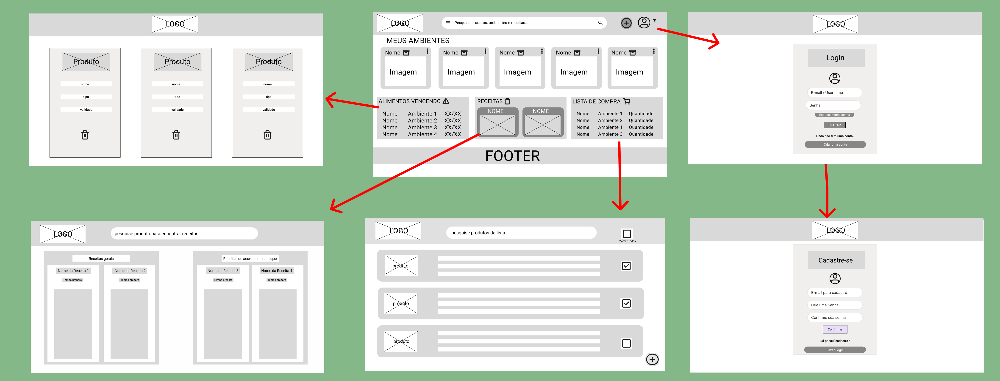

# Introdução

* **Projeto:** StockIT
* **Repositório GitHub:** https://github.com/ICEI-PUC-Minas-CC-TI/ti1-2025-1-t2-manha-gerenciaralimentos
* **Hospedagem**: https://icei-puc-minas-cc-ti.github.io/ti1-2025-1-t2-manha-gerenciaralimentos/
* **Membros da equipe:**
  
[Arthur Henrique Tristão Pinto](https://github.com/arthurhtp)

[Davi Rafael de Oliveira Gurgel Martins](https://github.com/davi080107)

[Diego Cunha da Silva](https://github.com/Diego290406)

[Gabriel Pereira Couto Rodrigues](https://github.com/GabrielPereira-PUC)

[Raphael Lucas Ribeiro de Paula](https://github.com/RaphaelLRPaula)

A documentação do projeto é estruturada da seguinte forma:

1. Introdução
2. Contexto
3. Product Discovery
4. Product Design
5. Metodologia
6. Solução
7. Referências Bibliográficas

✅ [Documentação de Design Thinking (MIRO)](files/document.pdf)

# Contexto

## Problema

A gestão de alimentos é um desafio recorrente em diversos contextos, desde residências até comércios e empresas do setor alimentício. A desorganização e a falta de controle da validade e quantidade dos produtos frequentemente resultam em desperdício de alimentos, prejuízos financeiros, e riscos à saúde dos consumidores. Ambientes compartilhados, como repúblicas, também enfrentam confusão quanto à propriedade dos alimentos, o que reforça a necessidade de uma ferramenta de gerenciamento clara e acessível.

---

## Objetivos

O projeto **StockIT** foi criado para desenvolver uma aplicação web responsiva e intuitiva, voltada para a organização e controle de estoques domésticos ou comerciais. Entre seus objetivos, destacam-se:

- Controlar alimentos por ambiente (geladeira, despensa, freezer etc.);
- Gerenciar validade e quantidade de produtos;
- Notificar alimentos próximos do vencimento;
- Facilitar a criação de listas de compras automáticas;
- Otimizar o uso dos produtos e evitar perdas;
- Permitir o compartilhamento de ambientes com múltiplos usuários.

---

## Justificativa

Segundo dados da FAO (Organização das Nações Unidas para Agricultura e Alimentação), cerca de um terço dos alimentos produzidos mundialmente é desperdiçado. Grande parte disso ocorre no consumo final, por má gestão ou organização.  
Com base em entrevistas qualitativas com usuários reais e análise de ferramentas já existentes, **StockIT** surge como uma solução prática e escalável para esse problema, promovendo não apenas economia e organização, mas também um consumo mais consciente e sustentável.

---

## Público-Alvo

- **Empresários do ramo alimentício**: desejam evitar desperdícios, manter controle de validade e evitar perdas financeiras.
- **Donos de restaurantes**: precisam de agilidade e segurança no controle de alimentos, otimizando o preparo e o estoque.
- **Donos e donas de casa**: buscam praticidade para organizar os alimentos da família e gerar listas de compras automatizadas.
- **Moradores de repúblicas**: necessitam identificar seus alimentos em ambientes compartilhados, evitando confusões.
- **Cozinheiros e auxiliares de cozinha**: desejam agilidade na visualização dos alimentos disponíveis e na organização da produção diária.


# Product Discovery

## Etapa de Entendimento

✳️[Matriz CSD](files/matrizCSD.pdf)

✳️[Mapa de Stakeholders](files/mapa.pdf)

### Entrevistas Qualitativas

✳️[Dona de bar](files/entrevista-qualitativa-bar.pdf)

✳️[Dona de cafeteria](files/entrevista-qualitativa-cafeteria.pdf)

✳️[Cozinheiro](files/entrevista-qualitativa-cozinheiro.pdf)

✳️[Dona de casa](files/entrevista-qualitativa-dona.pdf)

✳️[Enfermeira](files/entrevista-qualitativa-enfermeira.pdf)

✳️[Socia de restaurante](files/entrevista-qualitativa-socia.pdf)

✳️[Highlights de pesquisa](files/highlight.pdf)

## Etapa de Definição

### Personas e Proposta de Valor

✳️[Cliente empresa](files/cliente-empresa.pdf)

✳️[Cliente pessoa](files/cliente-pessoa.pdf)

✳️[Cliente pessoa gastronomia](files/cliente-pessoa.pdf)

# Product Design

Nesse momento, vamos transformar os insights e validações obtidos em soluções tangíveis e utilizáveis. Essa fase envolve a definição de uma proposta de valor, detalhando a prioridade de cada ideia e a consequente criação de wireframes, mockups e protótipos de alta fidelidade, que detalham a interface e a experiência do usuário.

## Histórias de Usuários

Com base na análise das personas foram identificadas as seguintes histórias de usuários:

✳️[Usuario empresa](files/usuario-empresa.pdf)

✳️[Usuario pessoa](files/usuario-pessoa.pdf)

## Requisitos

As tabelas que se seguem apresentam os requisitos funcionais e não funcionais que detalham o escopo do projeto.

### Requisitos Funcionais

| ID     | Descrição do Requisito                                                                                              | Prioridade |
|--------|----------------------------------------------------------------------------------------------------------------------|------------|
| RF-01  | O sistema deve permitir a criação de ambientes em que os alimentos serão guardados. Ex: geladeira, dispensa etc     | ALTA       |
| RF-02  | Permitir cadastro, leitura, atualização e exclusão de alimentos com nome, tipo, validade, dono.                     | ALTA       |
| RF-03  | O sistema deve emitir notificações quando o produto estiver quase vencendo e quando tiver pouco no estoque.         | ALTA       |
| RF-04  | O sistema deve permitir a busca de produtos específicos do estoque pelo usuário.                                    | ALTA       |
| RF-05  | Deve haver uma opção para criar uma lista de compras com os produtos necessários.                                   | ALTA       |
| RF-06  | O sistema deve mostrar receitas com os alimentos perto da data de validade.                                         | MÉDIA      |
| RF-07  | O sistema deve demonstrar as maneiras corretas de armazenar os produtos seguindo padrões sanitários.                | MÉDIA      |
| RF-08  | O sistema deve mostrar um tutorial simples (vídeo) sobre como operar o aplicativo.                                  | BAIXA      |
| RF-09  | Permitir múltiplos usuários com acesso a um mesmo ambiente.                                                         | ALTA       |
| RF-10  | Permitir o usuário criar uma conta com user e senha.                                                                | ALTA       |
| RF-11  | O sistema deve autenticar o login do usuário conforme o cadastro.                                                   | ALTA       |
| RF-12  | Definir permissões para administradores, editores e visualizadores nos ambientes.                                   | ALTA       |
| RF-13  | O sistema deve permitir que o contato com os fornecedores seja facilitado ou automático, conforme o estoque.        | MÉDIA      |
| RF-14  | Deve ser possível cadastrar um produto por meio da leitura do código de barras.                                     | ALTA       |
| RF-15  | O sistema deverá permitir o uso offline com funções sincronizadas no último período de internet.                    | MÉDIA      |


### Requisitos não Funcionais

| ID      | Descrição do Requisito                                                                                              | Prioridade |
|---------|----------------------------------------------------------------------------------------------------------------------|------------|
| RNF-01  | O sistema deve funcionar corretamente em diferentes navegadores (Chrome, Firefox, Opera, etc).                      | ALTA       |
| RNF-02  | O sistema deve estar de acordo com a regulamentação de órgãos de fiscalização sanitária.                            | ALTA       |
| RNF-03  | Toda pesquisa e alteração no banco de dados deve retornar e atualizar em menos de 1 segundo.                        | ALTA       |
| RNF-04  | O programa deve operar em conjunto com uma API para leitura de produtos por código de barras.                       | MÉDIA      |
| RNF-05  | O sistema deve ter interface intuitiva e ser de fácil acesso, com aprendizado em até 30 minutos.                    | ALTA       |
| RNF-06  | O sistema deve estar disponível 97% do tempo na semana.                                                             | MÉDIA      |
| RNF-07  | O programa deve operar em conjunto com a OpenAI para dar sugestões de receitas.                                     | BAIXA      |
| RNF-08  | O desenvolvimento deve ser feito na linguagem HTML.                                                                 | MÉDIA      |
| RNF-09  | O sistema deve ser responsivo e funcionar corretamente em celulares.                                                | ALTA       |
| RNF-10  | O sistema deve ter harmonização de cores e formas para melhorar a experiência do usuário.                           | MÉDIA      |

## Projeto de Interface

Artefatos relacionados com a interface e a interacão do usuário na proposta de solução.

### Wireframes

Estes são os protótipos de telas do sistema.

##### Home 

A página de home apresenta uma visão geral dos principais recursos do sistema, nela se encontram os ambientes cadastrados,alimentos próximos do vencimento, 
sugestões de receitas. lista de compras e acesso ao perfil


##### Lista de Compras

Mostra todos os produtos adicionados à lista de compras, com imagem do produto, podendo alterar a quantidade e adicionar e/ou remover alimentos.


##### Receitas

A parte de receitas mostrará receitas baseadas em alimentos próximos do vencimento, além uma barra de pesquisa para encontrar receitas para itens especificados pelo usuário


##### Login

A aba de Login  consiste em um layout simples onde o usuário vai inserir o email e sua senha para entrar em sua conta na plataforma, essa aba tem botões que levam para a página home novamente, além dos botões de logar para entrar, o de esqueci minha senha para chegar a um passo a passo de como redefinir ela, e um botão cadastro, para situações onde o usúario não tem uma conta e precise de criar uma.


##### Cadastro

A aba de Cadastros consiste em um layout simples onde o usuário vai inserir o email e uma senha para criar uma conta na plataforma,
essa aba tem botões que levam para a página home novamente, além dos botões de logar para ir diretamente a pagina de login


##### Alimentos Vencendo

A tela de alimentos vencendo mostra todos os produtos que estão perto do vencimento, com nome, tipo e data de vencimento


### User Flow



### Protótipo Interativo

✅ [Protótipo Interativo (Figma)](https://www.figma.com/proto/KGYR6jkBXVf1r7llLhaWU0/Wireframes?node-id=102-61&t=EpulYV26tEVLHRd3-1)  

✅ [Embed (Figma)](https://embed.figma.com/design/KGYR6jkBXVf1r7llLhaWU0/Wireframes?node-id=0-1&embed-host=share) 

# Metodologia

Detalhes sobre a organização do grupo e o ferramental empregado.

## Ferramentas

Relação de ferramentas empregadas pelo grupo durante o projeto.

| Ambiente                    | Plataforma | Link de acesso                                     |
| --------------------------- | ---------- | -------------------------------------------------- |
| Processo de Design Thinking | Miro       | https://miro.com/app/board/uXjVIR2DbNk=/|
| Repositório de código     | GitHub     | https://github.com/ICEI-PUC-Minas-CC-TI/ti1-2025-1-t2-manha-gerenciaralimentos|
| Hospedagem do JSON SERVER         | RENDER    |https://json-server-stockit.onrender.com|
| Protótipo Interativo       | Figma  | https://www.figma.com/design/KGYR6jkBXVf1r7llLhaWU0/Wireframes?node-id=0-1&p=f&t=Yz1McRHG52bb3BKm-0|
| Reuniões Periódicas        |Discord            | https://discord.com |
| Editor de Código        |VsCode            |https://code.visualstudio.com|
| Hospedagem        |GITHUB PAGES            |https://icei-puc-minas-cc-ti.github.io/ti1-2025-1-t2-manha-gerenciaralimentos/|

## Gerenciamento do Projeto

Designer: Davi e Arthur

Desenvolvedor Front-End: Raphael

Product Owner: Gabriel

Scrum Master: Diego


# Solução Implementada

Esta seção apresenta todos os detalhes da solução criada no projeto.

## Vídeo do Projeto

O vídeo a seguir traz uma apresentação do problema que a equipe está tratando e a proposta de solução.

Click na imagem para ser redirecionado para o vídeo.

[](https://youtu.be/GhBHLbi5HdA)

## Funcionalidades

##### Tela Inicial  
Permite acesso a todos outras páginas


Esta seção apresenta as funcionalidades do site StockIt.

##### Funcionalidade 1 - Adicionar Ambientes 

Permite a criação de um novo ambiente onde será armazenado os alimentos. 

* **Estrutura de dados:** Ambientes
* **Instruções de acesso:**
  * Abra o site e efetue o login
  * Acesse o menu principal e escolha a opção Adicionar Ambientes.
  * Em seguida, dê um nome ao ambiente e escolha o seu tipo.

  **Tela da funcionalidade**:

  

  ##### Funcionalidade 2 - Pesquisar ambientes e alimentos 

Permite encontrar um ambiente ou um alimentos a partir da barra de pesquisa. 

* **Estrutura de dados:** Ambientes e Alimentos
* **Instruções de acesso:**
  * Abra o site e efetue o login
  * Acesse o menu principal e pesquise um ambiente ou alimento na barra de pesquisa.
  * Em seguida, clique no ambiente/alimento pesquisado

* **Tela da funcionalidade**:


##### Funcionalidade 3 - Notificação de alimentos vencendo 

Notifica quando um alimento está vencendo.  

* **Estrutura de dados:** Alimentos e ambientes
* **Instruções de acesso:**
  * Abra o site e efetue o login
  * Acesse o menu principal e clique no sino no canto superior direito.
  * Em seguida, veja se deseja ver em qual ambiente o alimento em vencimento está ou se deseja exclui-lo.

* **Tela da funcionalidade**:


##### Funcionalidade 4 - Exclusão de alimentos vencendo 

Permite excluir alimentos que estão vencendo.  

* **Estrutura de dados:** Alimentos
* **Instruções de acesso:**
  * Abra o site e efetue o login
  * Acesse o menu principal e clique no botão "Alimentos Vencendo".
  * Em seguida, exclua o alimento que quiser excluir. 

* **Tela da funcionalidade**:


##### Funcionalidade 5 - Receitas com alimentos próximos da data de validade

Permite descobrir diferentes receitas com alimentos que estão próximos do vencimento.   

* **Estrutura de dados:** Alimentos
* **Instruções de acesso:**
  * Abra o site e efetue o login
  * Acesse o menu principal e clique no botão "Receitas".
  * Em seguida, veja no google ou no Tudo Gostoso receitas com o alimento escolhido. 

* **Tela da funcionalidade**:


##### Funcionalidade 6 - Lista de Compras

Permite ver, pesquisar, editar a quantidade e excluir alimentos nas listas de compras.    

* **Estrutura de dados:** Lista de compras, alimentos
* **Instruções de acesso:**
  * Abra o site e efetue o login
  * Acesse o menu principal e clique no botão "Lista de Compras".
  * Em seguida, adicione, pesquise, mude a quantidade ou exclua um alimento na lista de compra. 

* **Tela da funcionalidade**:


##### Funcionalidade 7 - Ambientes

Permite ver, pesquisar, editar a quantidade e validade, excluir e mover um alimentos nos ambientes criados.    

* **Estrutura de dados:** ambientes
* **Instruções de acesso:**
  * Abra o site e efetue o login
  * Acesse o menu principal e clique em um dos ambientes do carrosel.
  * Em seguida, adicione, pesquise, mude a quantidade ou validade, mova para outro ambiente ou exclua um alimento pelos ambientes cadastrados. 

* **Tela da funcionalidade**:


##### Funcionalidade 8 - Criar lista de compra

Permite criar, atualizar e excluir uma lista de compra.    

* **Estrutura de dados:** alimentos
* **Instruções de acesso:**
  * Abra o site e efetue o login
  * Acesse o menu principal e clique em "listas de Compra".
  * Em seguida, clique no botão "criar lista".
  * Dê nome, adicione os alimentos que deseja na lista e crie a lista. Poderá também exclui-la ou atualiza-la.  

* **Tela da funcionalidade**:


## Estruturas de Dados

##### Estrutura de Dados - Ambientes

Ambientes Cadastrados na aplicação

```json
  {
      "id": "1",
      "nome": "Geladeira",
      "tipo": 1,
      "imagem": "geladeira.png",
      "itens": [
        {
          "alimentoId": 1,
          "quantidade": 5,
          "vencimento": "2025-02-12",
          "cadastro": "2025-02-05"
        }
      ]
  }
  
```
##### Estrutura de Dados - Alimentos

Alimentos Cadastrados no Sistema

```json
    {
      "id": "1",
      "nome": "banana",
      "tipo": "prata",
      "imagem": "banana-prata.png",
      "categoria": 1
    }
  
```
##### Estrutura de Dados - Lista de Compras

Listas de Compras do Usuário

```json
  {
      "id": "1",
      "nome": "Lista Casa",
      "itens": [
        {"alimentoId": 1,"quantidade": 5},
        {"alimentoId": 2,"quantidade": 2}
      ]
    }
  
```
##### Estrutura de Dados - Categoria de Alimentos

Representa as 10 categorias de caracterização do alimento

```json
    {"id": "0","categoria": "Outros"},
    {"id": "1","categoria": "Fruta"},
    {"id": "2","categoria": "Legume"},
    {"id": "3","categoria": "Vegetal"},
    {"id": "4","categoria": "Carne Bovina"},
    {"id": "5","categoria": "Carne Suína"},
    {"id": "6","categoria": "Aves"},
    {"id": "7","categoria": "Peixes e Frutos do Mar"},
    {"id": "8","categoria": "Soja e Derivados"},
    {"id": "9","categoria": "Laticínio"},
    {"id": "10","categoria": "Grãos e Cereais"}
  
```
##### Estrutura de Dados - Tipos de Ambientes

Representa os Tipos de Ambiente

```json
    {"id": "0","tipo": "Outros"},
    {"id": "1","tipo": "Refrigeração"},
    {"id": "2","tipo": "Seco"},
    {"id": "3","tipo": "Congelado"} 
```
##### Estrutura de Dados - Usuários

Guarda a autenticaçao dos usuários

```json

  {
    "id": 1,
    "email": "ana@stockit.com",
    "senha": "1234"
  },
  {
    "id": 2,
    "email": "lucas@stockit.com",
    "senha": "senha123"
  },
  {
    "id": 3,
    "email": "maria@stockit.com",
    "senha": "abc123"
  },
  {
    "email": "teste@gmail.com",
    "senha": "12345",
    "id": 4
  },
  {
    "email": "Diego@gmail.com",
    "senha": "123",
    "id": 5
  }
```

## Módulos e APIs

Esta seção apresenta os módulos e APIs utilizados na solução

**Fonts:**

- [Google Fonts](https://fonts.google.com/) – Utilizado para aplicar tipografia personalizada e moderna no layout da interface.
- [Font Awesome](https://fontawesome.com/) – Biblioteca de ícones amplamente usada no projeto para tornar a navegação mais intuitiva e visual.

**Scripts:**
- [JSON Server](https://github.com/typicode/json-server) – Utilizado como servidor REST fake para persistência e consumo de dados simulando um backend real.
- [Render](https://render.com/) – Plataforma de hospedagem usada para disponibilizar a API JSON Server de forma gratuita e acessível à equipe.
 - [Bootstrap 5](http://getbootstrap.com/) 

**APIs:**

# Referências

As referências utilizadas no trabalho foram:

FIGMA. Figma: Ferramenta de design de interface e prototipagem online. Disponível em: https://www.figma.com. Acesso em: 8 abr. 2025.

DISCORD. Discord: Plataforma de comunicação por voz, vídeo e texto. Disponível em: https://discord.com. Acesso em: 8 abr. 2025.

GOOGLE. Google Docs: Editor de texto colaborativo online. Disponível em: https://docs.google.com. Acesso em: 8 abr. 2025.

MIRO. Miro: Plataforma colaborativa para quadros visuais e brainstorming. Disponível em: https://miro.com. Acesso em: 8 abr. 2025.

GITHUB. GitHub: Plataforma de hospedagem de código e controle de versão. Disponível em: https://github.com. Acesso em: 8 abr. 2025.
